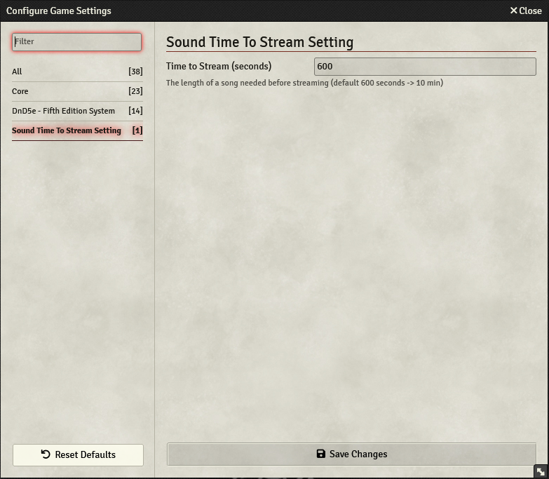

# Audio duration until stream setting   

Usually only music with a length of 10 Minutes or more are streamed. 

This Module allows to change the minimum length required for streaming. 

Changing the setting to 30 will stream audio with the length of 30 seconds+, helpful for people who self-host and uploading a 9-minute song to multiple people would take ages but the bandwidth is enough for streaming.

## Setting image:

# Side effects
I do not know what are the downsides to stream audio and why FoundryVTT only does Stream after 10 minutes.
This Module does only modify one Variable, it does not add/modify any code of existing Foundry code, so there should be no compatibility issues.